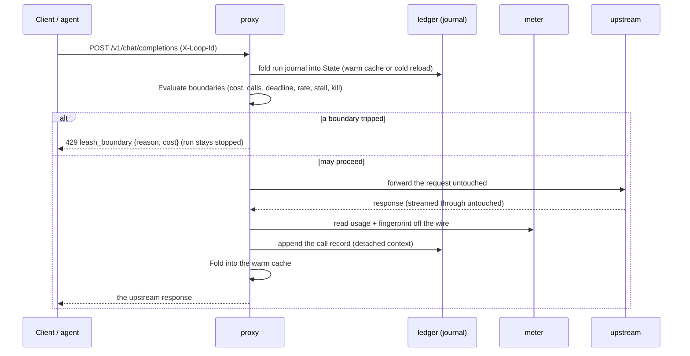

# Architecture

This is the map to read before changing leash. It covers the layering, the path
one request takes, the invariants every change must preserve, and where to make a
given kind of change. For the enforcement model in prose, see
[docs/how-leash-works.md](docs/how-leash-works.md); for the decisions behind the
design, see [docs/adr/](docs/adr/).

## The one idea

leash sits in front of model calls, meters what the wire reports, folds it into a
durable per-run total, and refuses the next call when a boundary trips. Every
guarantee is a guarantee about that total. The rest is plumbing around it.

## Layers

Dependencies point downward only. The `policy` core has no I/O and no knowledge
of HTTP, the ledger, or time beyond what it is handed.

```
cmd/leash        flags, subcommands, process wiring, the stop line
  |
internal/wrap    Tier 1: launch a child with its base URL pointed at the proxy
internal/proxy   the enforcement engine: HTTP in, decide, forward, meter, record
  |        \
  |         internal/meter   read usage + assistant text off the wire (JSON, SSE)
  |
internal/ledger  durable append-only journal on a rerun.Store (SQLite / Postgres)
  |
internal/policy  pure core: boundaries, the cost model, State and its Fold
  |
internal/term    TTY-aware color for the human output
```

- **policy** is the brain and is deliberately dumb about the world: given a
  `State` and a `CallRecord`, `Fold` advances the total; given a `State` and a
  clock, `Evaluate` reports the first tripped boundary. It is pure and
  deterministic, so a journal replays to the exact same state.
- **ledger** is the durable account. It only ever appends; a run's totals are
  rebuilt by folding the journal. It stores accounting, fingerprints, and stop
  reasons, never bodies or secrets.
- **meter** turns a provider response into a `policy.Usage`. It is conservative:
  it reports usage only when the provider's expected fields are present, so a
  mis-tagged or unreadable response is blind, not a false zero.
- **proxy** is where it all meets: it resolves a run, folds its journal into a
  cached `State`, evaluates the boundaries, and forwards or refuses. It owns the
  warm cache and the fail-closed behavior.
- **wrap** is Tier 1 only: it injects `OPENAI_BASE_URL` / `ANTHROPIC_BASE_URL`
  into a child and runs it against an embedded proxy.

## The path of one request



The record is appended **after** the response is delivered. A crash before that
point undercounts by one call (safe) and can never double count. The append uses
a detached context so a client that disconnects mid-stream cannot drop it.

## Invariants (every change must preserve these)

1. **At most once.** A call is counted at most once. A crash or a
   committed-but-errored retry may undercount by one, never over. Enforced by
   post-response recording and idempotent-by-tag appends
   ([ADR-0003](docs/adr/0003-at-most-once-counting.md)).
2. **Warm equals cold.** The in-memory `State` is always equal to a cold fold of
   the journal. The warm path is a cache, never a second source of truth. Any new
   folding must go through `Governor.Fold` so both paths stay identical.
3. **Stopped stays stopped.** Once a run stops, every later call for it gets the
   same answer, across restarts. The rate limit is the one exception: it is
   transient backpressure, not a terminal stop
   ([ADR-0007](docs/adr/0007-rate-limit-is-transient.md)).
4. **Fail closed on the money.** When a cost budget is active and a call cannot be
   priced, leash refuses rather than spends blind
   ([ADR-0002](docs/adr/0002-fail-closed-metering.md)).
5. **One governor per ledger.** A ledger has one active governor; a second is
   refused (or waits, with `--standby`).

## Where to make a change

| You want to... | Change |
|---|---|
| add a boundary | a type in `internal/policy/boundary.go` + wire it in `NewGovernor` |
| change the cost model | `internal/policy/cost.go` |
| read a new provider or wire shape | `internal/meter/` (parse.go, stream.go, provider.go) |
| add a metric or event | `internal/proxy/observer.go` + `metrics.go` |
| change durable storage | `internal/ledger/` (behind the `rerun.Store` seam) |
| add a flag or subcommand | `cmd/leash/` |

## Testing shape

Unit tests per package; `-race` on everything; mutation testing on the core
(`make mutate`); property tests for the invariants above
(`internal/policy`, `internal/ledger`); a fault-injection harness that breaks the
ledger at each boundary (`internal/proxy`); postgres-gated ledger tests in CI;
and an end-to-end smoke test (`examples/demos/smoke.sh`) that exercises the whole
path against a real listener. See [CONTRIBUTING.md](CONTRIBUTING.md) for the gate.
