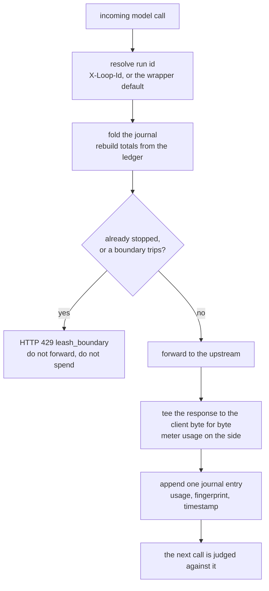
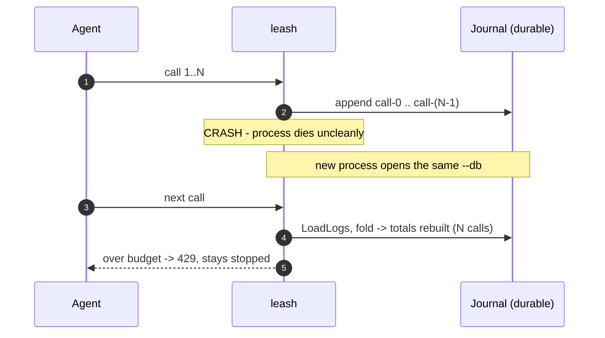
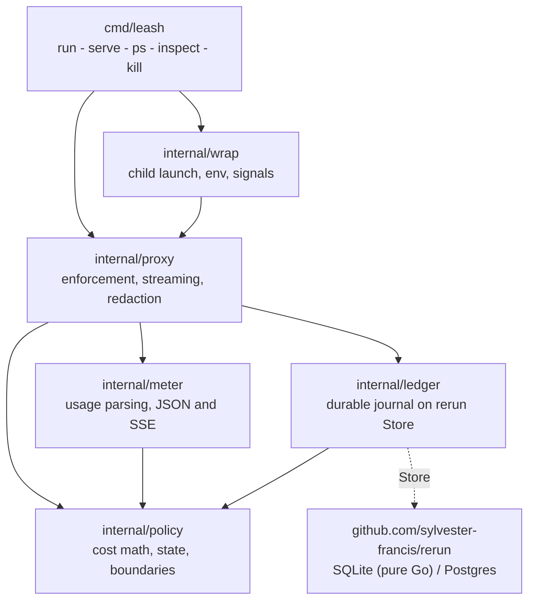

<div align="center">

<pre>
 _      ______           _____ _    _
| |    |  ____|   /\    / ____| |  | |
| |    | |__     /  \  | (___ | |__| |
| |    |  __|   / /\ \  \___ \|  __  |
| |____| |____ / ____ \ ____) | |  | |
|______|______/_/    \_\_____/|_|  |_|
</pre>

### A durable spend governor for AI agents  -  stop  -  survive restart  -  resume

**Put leash in front of your agent and it stops burning money: on cost, calls, time, runaway rate, repetition, or a kill - with accounting that survives a crash, so a restart can never reset the budget and re-spend.**

[](https://go.dev/dl/)
[](#testing)
[](#design)
[-96%25-44cc11)](#testing)
[](LICENSE)
[](#guarantees-and-non-goals)

`leash -- python my_agent.py` - zero code change, one binary, one stop line.

</div>

---

## The thirty-second pitch

An agent loop does not cost a flat amount per step, and it does not always know
when to quit. A framework's max-steps setting is in-memory and resets on
restart. A gateway's budget cap is a per-key total, not a per-run one. leash is
the missing piece: **durable per-run accounting that a restart cannot reset**,
plus a compute meter for self-hosted agents whose real bill is machine time.

leash is one Go binary and one idea: sit in front of the model calls, count what
the wire actually reports, and refuse the next call the moment a boundary trips.
The refusal is an ordinary HTTP 429 with a machine-readable reason, so the
agent's own loop ends because its next call fails. No SDK to adopt, no servers,
no YAML. The core is the standard library plus one dependency.

```console
$ leash --max-cost 5.00 --prices prices.json -- python my_agent.py
... agent runs, every model call metered and journaled ...
leash: stopped run a3f9 after 18 calls, $4.10 tokens + $0.91 compute = $5.01 (cost_budget)
$ echo $?
3
```

If leash is killed uncleanly mid-run and restarted on the same database, the run
resumes with its totals intact: a run that was over budget stays stopped, and no
call is ever counted twice.

> **New to durable spend control?** [`docs/how-leash-works.md`](docs/how-leash-works.md)
> is a concept-to-code tour: the enforcement decision, the journal that is the
> source of truth, and how a crash resumes without double counting.

## How it works

Every model call passes through one decision. leash rebuilds the run's totals by
folding its durable journal, evaluates the boundaries in a fixed order, and
either refuses the call or forwards it and records what it cost.



The journal is the source of truth; in-memory state is only a cache of it. A
call is counted exactly when its journal entry exists, which is why a crash can
undercount by at most the one call in flight, and can never double count.

> **What you persist is not a running total, but the result every completed call
> produced.** With the per-call records in hand, a restart rebuilds the exact
> same totals by replaying them.

## Mental models

Three ways to hold the idea. Pick whichever sticks.

**1 - The ledger is the budget; the process is a cache.** The authoritative
account is on disk, one append-only entry per governed call. The running proxy
holds a convenient copy, but if it dies, the truth is untouched and the next
process rebuilds the copy by folding the journal.

**2 - Stopping is a fact you write down, not a flag you hold.** When a boundary
trips, leash appends a `stop` entry naming the reason and freezing the totals.
From then on, every call for that run - in this process or the next one - reads
that entry and returns the same 429. The stop outlives the process that decided
it.

**3 - leash meters the wire, never a guess.** Token counts come only from what
the provider reports (`usage` in JSON, a final chunk or `message_delta` in a
stream). If the wire says nothing, the token meter is blind for that call: leash
counts zero, warns once, and leans on the boundaries that do not need token
counts (calls, time, stall, kill).

## Install

```sh
go install github.com/sylvester-francis/leash/cmd/leash@latest
```

Or build from a checkout:

```sh
git clone https://github.com/sylvester-francis/leash
cd leash && make build   # produces ./leash
```

leash needs Go 1.25+ and builds as a single static binary with no C toolchain
(the SQLite ledger is pure Go via `modernc.org/sqlite`).

## The 60-second demo

No API key, no real spend: a fake provider plus a curl loop under a 10-cent
budget. From a checkout:

```sh
# 1. A standard-library fake provider that always reports usage.
go run ./examples/fakeupstream &

# 2. Prices are yours to supply; leash ships none.
echo '{"demo-model": {"input": 10.0, "output": 30.0, "reasoning": 0}}' > prices.json

# 3. A 10-iteration agent under a 10-cent budget.
go run ./cmd/leash \
  --max-cost 0.10 --prices prices.json \
  --upstream http://127.0.0.1:9099 --db ./demo.db --run demo -- \
  sh -c 'for i in $(seq 1 10); do
           curl -s "$OPENAI_BASE_URL/chat/completions" -d "{\"model\":\"demo-model\"}" \
             -o /dev/null -w "agent call $i -> HTTP %{http_code}\n"
         done'
```

Real captured output (each call is 2.5 cents, so the budget trips on the fifth):

```console
agent call 1 -> HTTP 200
agent call 2 -> HTTP 200
agent call 3 -> HTTP 200
agent call 4 -> HTTP 200
agent call 5 -> HTTP 429
agent call 6 -> HTTP 429
agent call 7 -> HTTP 429
agent call 8 -> HTTP 429
agent call 9 -> HTTP 429
agent call 10 -> HTTP 429
leash: stopped run demo after 4 calls, $0.10 tokens + $0.00 compute = $0.10 (cost_budget)
```

## Three front doors, one engine

leash is the same governor behind three surfaces. See
[`docs/wrapping-agents.md`](docs/wrapping-agents.md) and
[`docs/gateway.md`](docs/gateway.md) for the full guides.

**Tier 1 - wrap (the headline).** Zero code change. leash starts an embedded
proxy on a free port, sets the base-url variables the SDK already reads, runs
your command as a child, governs every call, prints one stop line, and exits
with the child's code (or 3 on a boundary stop):

```sh
leash -- python my_agent.py
```

**Tier 2 - serve (the gateway).** A standalone proxy for any language, CI, or a
shared team gateway. Point the agent's `base_url` at leash and tag each run with
an `X-Loop-Id` header so it gets its own durable budget:

```sh
leash serve --listen :8088 --max-cost 5.00 --prices prices.json
```

## The boundaries

Evaluated in this fixed order; the first to trip stops the run. A zero value
disables a boundary; the kill switch is always active. Full detail and gotchas
in [`docs/boundaries.md`](docs/boundaries.md).

| Order | Boundary | Flag | Trips when |
|---|---|---|---|
| 1 | kill switch | (`leash kill <run>`) | a durable kill was recorded for the run |
| 2 | deadline | `--deadline` | wall-clock since the first call reaches the limit |
| 3 | cost budget | `--max-cost` | token cost plus compute cost reaches the budget |
| 4 | max calls | `--max-calls` | the run has made that many governed calls |
| 5 | rate limit | `--rate tokens/window` | tokens in the trailing window exceed the max |
| 6 | stall | `--stall` | that many identical responses occur in a row |

## The cost model: two meters, one budget, your prices

The **token meter** uses a price table you supply with `--prices`, mapping each
model to dollars per million input, output, and reasoning tokens:

```json
{"gpt-4o": {"input": 2.5, "output": 10, "reasoning": 0}}
```

An unknown model or an absent table means that call's token cost is zero. leash
never hardcodes a price and never estimates tokens.

The **compute meter** is elapsed wall-clock time times `--compute-rate` (dollars
per hour, default zero) - the meter for a self-hosted agent whose real cost is
machine time, not tokens. Both meters feed one budget: `--max-cost` trips on
their sum. Details and worked examples in [`docs/cost-model.md`](docs/cost-model.md).

## The stop signal

A stopped call is refused with HTTP 429 and a machine-readable body, and every
later call for that run gets the same answer:

```json
{"error":{"type":"leash_boundary","reason":"cost_budget","run":"a3f9",
  "calls":18,"token_cost":4.10,"compute_cost":0.91,"total_cost":5.01}}
```

In wrapper mode leash also prints the one-line stop summary to stderr and exits
with code **3**, so a script can tell a governed stop from an ordinary child
failure.

## Durable accounting

Every governed call, kill, and stop is appended to a durable ledger (SQLite by
default at `$HOME/.leash/leash.db`, set with `--db`). Totals are rebuilt by
folding that journal. The guarantee, and it is tested: kill the proxy uncleanly
mid-run, start a new process on the same `--db`, and the run resumes with totals
intact; an over-budget run stays stopped; no entry is double counted.



Inspect the ledger from any process while a run is live:

```console
$ leash ps
RUN   CALLS  TOKENS$  COMPUTE$  TOTAL$  STATUS   REASON
demo  4      0.10     0.00      0.10    stopped  cost_budget

$ leash inspect demo
run demo  status stopped  calls 4
cost   $0.10 tokens + $0.00 compute = $0.10
tokens in 4000  out 2000  reasoning 0

SEQ  TAG     WHEN                       DETAIL
0    call-0  2026-07-03T15:08:05-04:00  demo-model in=1000 out=500 reasoning=0
...
4    stop    2026-07-03T15:08:05-04:00  stop: cost_budget

$ leash kill demo
leash: kill recorded for run demo; it stops on its next call
```

**Privacy is a property of what the ledger stores:** usage numbers, content
fingerprint hashes, timestamps, and stop reasons only. It never persists request
or response bodies, and Authorization and api-key headers are forwarded to the
upstream untouched and never logged or persisted. See
[`docs/durability.md`](docs/durability.md).

## Metering the wire

leash reads usage from real responses, in both wire formats and both shapes:

- **OpenAI-compatible:** non-streaming `usage.prompt_tokens` /
  `completion_tokens` / `completion_tokens_details.reasoning_tokens`. Streaming
  reports usage only in a final chunk, and only when the request set
  `stream_options.include_usage`.
- **Anthropic:** non-streaming `usage.input_tokens` / `output_tokens`. Streaming
  carries input tokens in `message_start` and cumulative output tokens in
  `message_delta`.

For streaming OpenAI requests, leash rewrites the body to set
`stream_options.include_usage=true` so the final chunk reports usage; turn it off
with `--no-inject` and accept a blind meter on those calls. Streaming responses
are teed to the client byte for byte as they arrive - leash never buffers a
whole stream. See [`docs/metering.md`](docs/metering.md).

## Flags

All boundaries default to safe, honest values and are overridable; a zero value
disables that boundary. Full reference: [`docs/cli-reference.md`](docs/cli-reference.md).

```
--max-cost      dollar budget over token + compute cost   (default 5.00)
--max-calls     maximum governed calls                    (default 100)
--deadline      wall-clock budget from the first call     (default 30m)
--rate          trailing token rate as tokens/window      (default off)
--stall         identical responses tolerated in a row    (default off)
--prices        path to a JSON price table                (default none)
--compute-rate  compute meter in dollars per hour         (default 0)
--upstream      upstream base URL override                (default inferred)
--db            ledger database path                      (default ~/.leash/leash.db)
--run           run name; reuse it to resume that budget  (default random)
--no-inject     do not add stream_options.include_usage   (default off)
--listen        serve address (leash serve only)          (default :8088)
```

The default cost budget is active only when a price table or compute rate makes
a meter live; otherwise leash warns, once and loudly, that the token meter is
blind.

## Design

Dependencies point one way only, inward toward the pure core. The policy core
knows nothing about HTTP, the ledger, or the clock beyond the timestamps handed
to it, so every decision it makes is reproducible from recorded inputs.



Each package changes for one reason: `policy` is the pure guarantee (cost,
state, boundaries); `meter` reads provider wires; `ledger` persists and replays;
`proxy` enforces per call; `wrap` runs the child; `cmd/leash` is the surface.

Repository layout:

```
leash/
  cmd/leash/              CLI: dispatch + the five subcommands
  internal/policy/        pure core: cost.go, state.go, boundary.go, report.go
  internal/meter/         provider.go, parse.go, stream.go, inject.go
  internal/ledger/        durable journal on rerun's Store (SQLite default)
  internal/proxy/         proxy.go (enforcement), transport.go (headers, tee)
  internal/wrap/          child launch, base-url injection, signals, exit codes
  examples/fakeupstream/  a std-lib fake provider for the demo
```

## Testing

```sh
make test         # go test ./...
go test -race ./... # the concurrent paths, race-clean
make vet
make ascii-check  # fail on any non-ASCII byte in .go or .md
make mutate       # mutation testing on the deterministic core
```

The suite covers each boundary end to end against a fake upstream, OpenAI and
Anthropic parsing (non-streaming and streaming, including the injected
`include_usage` path and the `--no-inject` blind path), the 429 body shape,
header redaction, an unclean-crash resume with no double count, a kill from a
second process, and a wrapper run where a looping child is cut off at a boundary
and leash exits 3.

Mutation testing uses [gremlins](https://github.com/go-gremlins/gremlins). The
last measured run on the policy core (`internal/policy`) killed 51 of 53 viable
mutants: **96.23% test efficacy, 100% mutator coverage**. The two survivors are
equivalent mutants (a guard at `elapsed <= 0` and a window comparison that cannot
change behavior). This figure is measured, not claimed; rerun it with
`make mutate`.

## Guarantees and non-goals

**leash is v0.x and unstable** - flags and formats may change between versions.

**What it guarantees:** per-run accounting is **durable** and **resumable**. A
run's totals survive a crash, an over-budget run stays stopped after a restart,
and no journal entry is double counted. Token counts are **exactly what the wire
reported** - never estimated. A call is counted at-most-once: the only way to
lose one is a crash in the narrow window after the upstream responds and before
the journal entry commits, which undercounts by one and never re-spends.

**What it cannot see:** whether your agent achieved its goal. leash bounds the
economics of a loop; it does not judge the work.

**Non-goals (deliberately not built):** no model routing, no dashboard or web UI,
no provider SDK dependencies, no hosted anything, no request/response body
persistence, no telemetry exporters in v1 (an observer seam is left for them),
and no YAML - flags and environment only.

## Documentation

- [`docs/getting-started.md`](docs/getting-started.md) - install and your first governed run, both tiers.
- [`docs/how-leash-works.md`](docs/how-leash-works.md) - the enforcement model and durability, concept to code.
- [`docs/boundaries.md`](docs/boundaries.md) - every boundary, when to reach for it, and its edges.
- [`docs/cost-model.md`](docs/cost-model.md) - price tables, the two meters, and the blind path.
- [`docs/wrapping-agents.md`](docs/wrapping-agents.md) - Tier 1 in depth, with Python and Node examples.
- [`docs/gateway.md`](docs/gateway.md) - Tier 2 as a sidecar or team gateway, and X-Loop-Id.
- [`docs/metering.md`](docs/metering.md) - streaming, usage injection, and the wire formats.
- [`docs/durability.md`](docs/durability.md) - the ledger, crash safety, ps/inspect/kill, multi-instance.
- [`docs/cli-reference.md`](docs/cli-reference.md) - every command, every flag, every exit code.
- [`docs/faq.md`](docs/faq.md) - honest answers, including what leash is not.
- [`CONTRIBUTING.md`](CONTRIBUTING.md) - how to build, test, and propose changes.

## License

[Apache License 2.0](LICENSE). leash depends on
[rerun](https://github.com/sylvester-francis/rerun) for its durable ledger.
