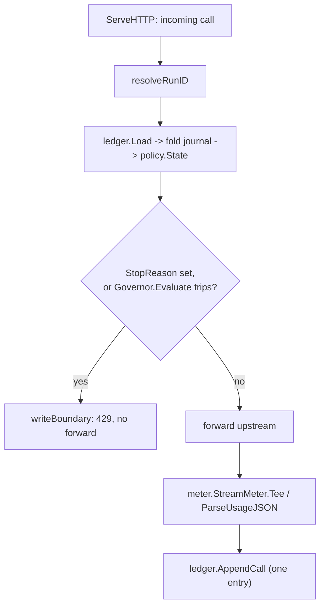
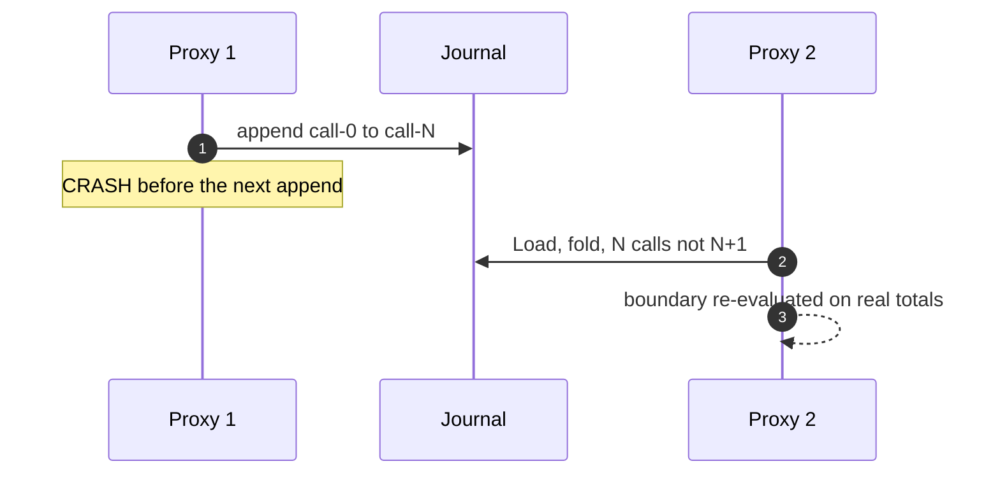

# How leash works

A concept-to-code tour of the enforcement model and the durability behind it.
The why before the how, with each idea pointing at the source that implements it.

## The problem

An agent loop has two properties that make it dangerous to run unattended. It
does not cost a flat amount per step - context accumulates, and a single step
can be far more expensive than the last. And it does not always know when to
quit - it can loop on an error, redo finished work, or run until a wall-clock or
token budget you never set is silently blown.

leash addresses exactly the second half: bounding the loop. It does not make the
agent smarter. It sits in front of the model calls and guarantees the loop ends
when a boundary you chose is crossed.

## The shape: a governor in front of the calls

Every governed model call passes through one HTTP handler,
`internal/proxy/proxy.go` (`Proxy.ServeHTTP`). That handler makes a single
decision per call: refuse it, or forward it and record what it cost. Nothing
else in leash decides whether an agent may spend.

The handler is fed by two front doors. In Tier 1 (`internal/wrap`), leash runs
your agent as a child process and points its base-url environment variables at
an embedded copy of this proxy. In Tier 2 (`leash serve`), the same proxy is a
standalone server. Same handler, same guarantee.

## The per-call decision

For each incoming call the handler does this, in order:

1. **Resolve the run id.** `resolveRunID` reads the `X-Loop-Id` header, else the
   wrapper-provided default, else `"default"`. A run is the unit of budgeting.
2. **Rebuild the run's totals from the journal.** `ledger.Load` reads every
   journal entry for the run and folds it into a `policy.State`. This is the
   authoritative account; the in-memory copy is discarded and rebuilt each call.
3. **Evaluate the boundaries.** `policy.Governor.Evaluate` refreshes the
   time-derived costs and checks each active boundary in a fixed order.
4. **Refuse or forward.** If the run is already stopped, or a boundary trips
   now, the handler writes an HTTP 429 with a machine-readable body and does not
   forward - no upstream call, no spend. Otherwise it forwards the request,
   streams the response back to the client while metering usage on the side,
   appends one journal entry, and returns.

The agent's own loop ends because its next call fails with a clear reason. leash
never reaches into the agent; it just stops answering.



## The journal is the source of truth

The most important idea in leash is that a run's totals are never trusted from
memory. They are recomputed, every call, by folding a durable journal.

The journal lives in `internal/ledger`, backed by rerun's `Store` (SQLite by
default). It holds three kinds of append-only entry:

- `call-N` - one governed call: its token usage, a content fingerprint hash, and
  a timestamp. No request or response body. No secrets.
- `kill` - a durable kill was recorded for this run.
- `stop` - the run stopped: the reason and the frozen final totals.

`ledger.Load` walks these in sequence order and folds them into a `policy.State`
with `Governor.Fold` (for calls), setting `Killed` on a kill entry and
`StopReason` on a stop entry. Folding is deterministic: the same journal always
produces the same totals. That single property is what makes a restart safe.

> What you persist is not a running total, but the result every completed call
> produced. With the per-call records in hand, recovery is replay, not guesswork.

## The boundaries, in a fixed order

`policy.NewGovernor` assembles the active boundaries in one order, and that order
is a property of the policy core rather than of how a caller happens to
configure it:

```
kill switch  ->  deadline  ->  cost budget  ->  max calls  ->  rate limit  ->  stall
```

`Governor.Evaluate` refreshes elapsed time and compute cost, then checks each in
turn and returns the first that trips. A zero-valued limit is simply omitted
from the list; the kill switch is always present. Each boundary is a tiny,
table-tested type in `internal/policy/boundary.go`. See
[boundaries.md](boundaries.md) for each one.

## Stopping is written down once

When a boundary trips for the first time, the handler sets `StopReason`, calls
`ledger.AppendStop` to record the reason and the frozen totals, and returns 429.
On every later call, `ledger.Load` reads that stop entry and sets `StopReason`
again, so the handler short-circuits to the same 429 without re-evaluating or
appending anything. The stop is a durable fact, not a flag held in the process
that decided it: a new process reading the same journal sees the run is stopped
and keeps it stopped.

## Crash safety: at-most-once, never double

The dangerous moment is the one call in flight when the process dies. leash
orders its work so that a crash is always safe:

- The boundary check runs on totals rebuilt from already-committed entries, so a
  restart re-derives the same decision.
- A call's journal entry is appended only after the upstream responds. A call is
  counted exactly when its entry exists.

That gives at-most-once counting. If leash dies in the narrow window after the
upstream responds but before the append commits, that one call is not counted -
an undercount of one, never a re-charge, never a double count. The crash-resume
test in `internal/proxy/crash_test.go` proves it end to end: kill the proxy
mid-run, open a fresh proxy on the same database, and the over-budget run stays
stopped with its totals intact and no entry counted twice.



## Sequencing under a concurrent writer

Journal positions are a composite key, so two writers must not claim the same
one. `ledger.appendNext` reads the current maximum sequence, appends at the next
slot, and retries a bounded number of times if a uniqueness conflict shows a
concurrent writer won the slot. That is what lets `leash kill` append a kill
entry from a second process while the governor is running, without corrupting
the journal.

## The lease

At startup the proxy acquires a governance lease via rerun's `Guarder.Acquire`.
With the SQLite backend this lease is process-local: it stops you from governing
the same run twice inside one process, and it is released automatically when the
process dies, so a restart resumes cleanly. True cross-process mutual exclusion
(two live processes governing the same run) is a property of the rerun postgres
backend, which replaces exactly this lease and nothing else. Cross-process reads
and a cross-process kill work today through SQLite's write-ahead log. See
[durability.md](durability.md).

## Cost is two meters over one budget

`policy.TokenCost` prices a call's usage under a caller-supplied table;
`policy.ComputeCost` prices elapsed wall-clock time at a caller-supplied rate.
`Governor.Evaluate` sums them into `TotalCost`, and the cost budget trips on that
sum. leash never hardcodes a price and never estimates a token count - it prices
only what the wire reported. See [cost-model.md](cost-model.md) and
[metering.md](metering.md).

## Why the core is pure

`internal/policy` has no dependency on the network, the ledger, or the clock
beyond the timestamps handed to it. Every boundary decision is a pure function of
recorded inputs, which is why the same journal replays to the same totals, why
the tests are deterministic, and why mutation testing can hold the core to a high
bar. The messy world - HTTP, streaming, child processes, SQLite - lives in the
layers around it and feeds the core clean, recorded facts.
